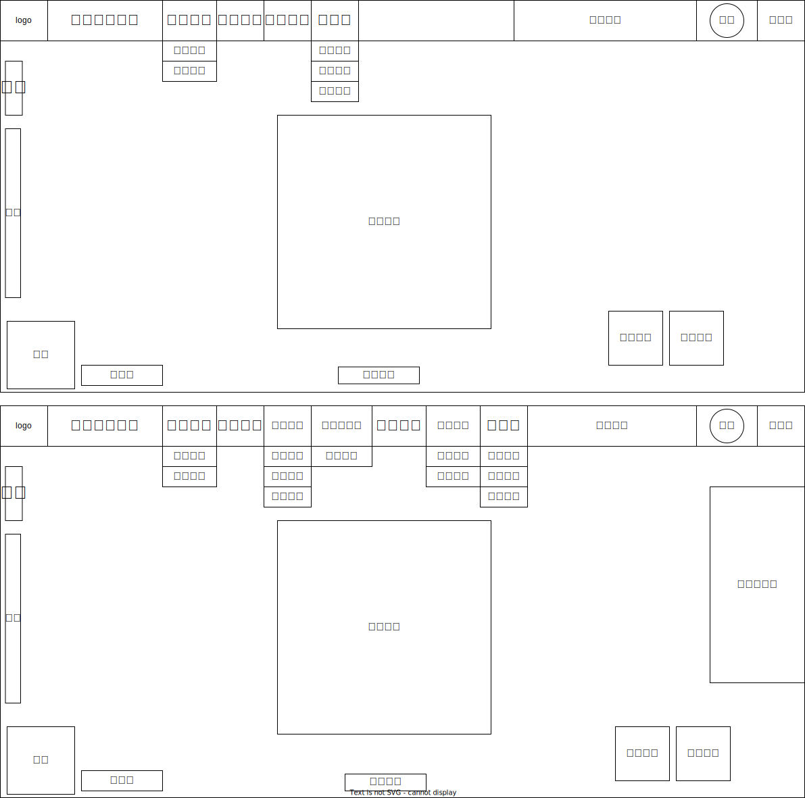
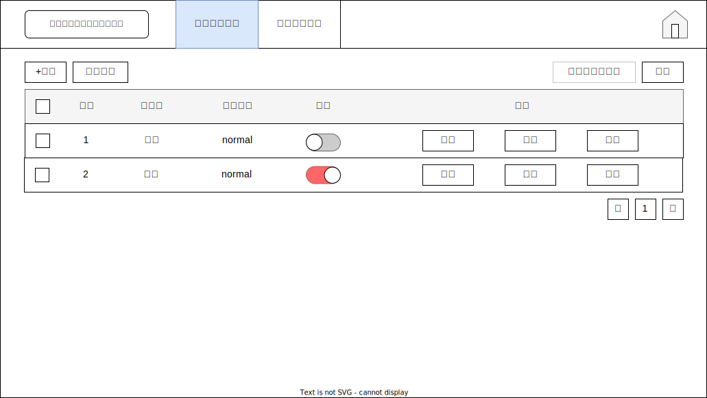
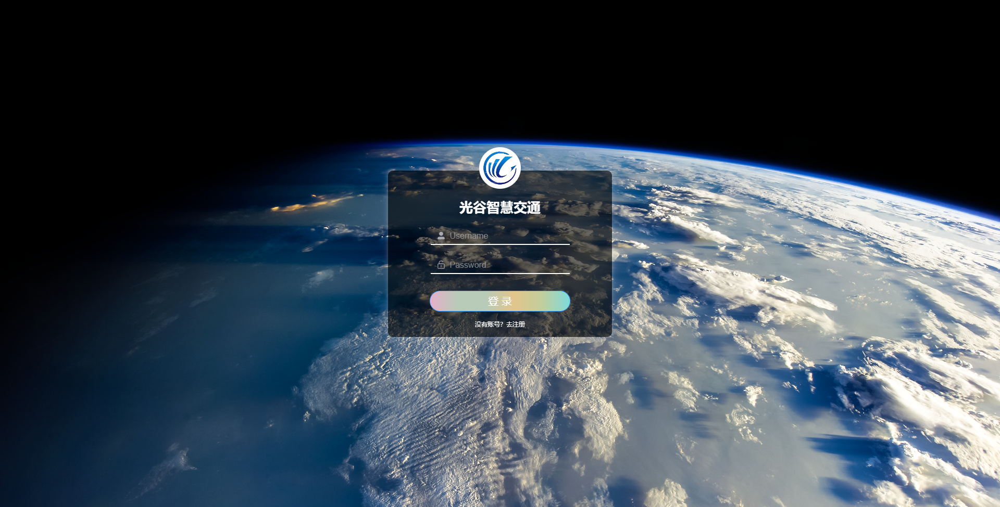
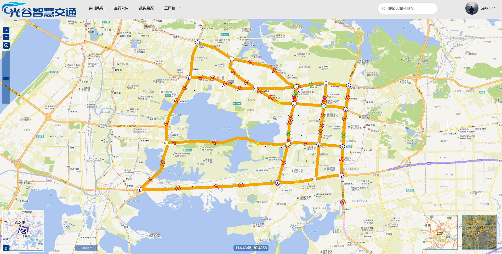
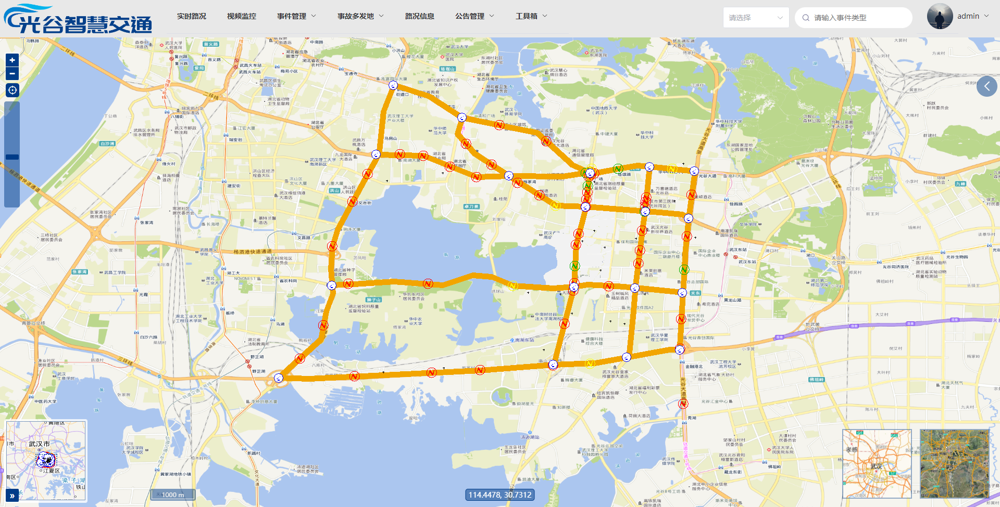
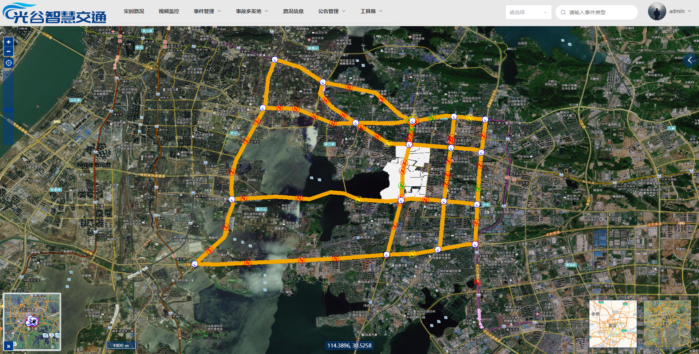
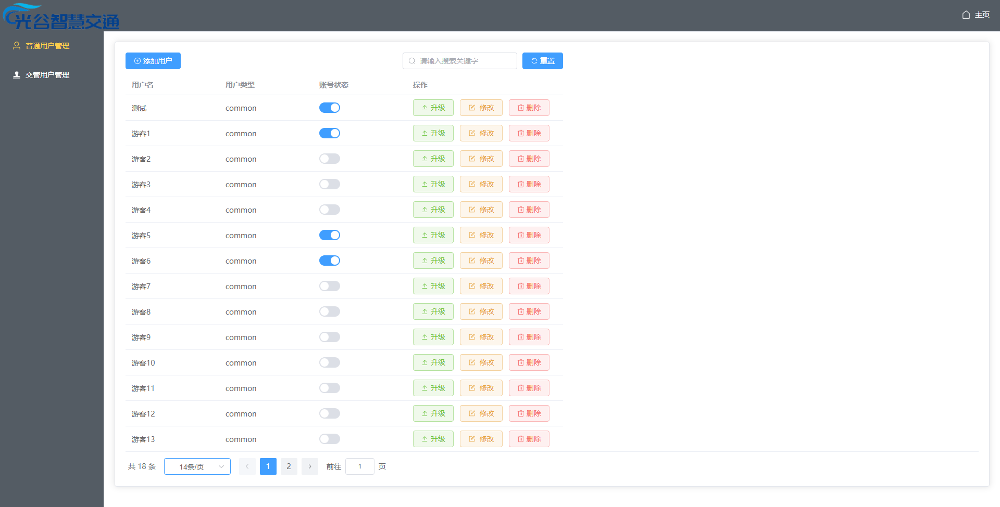

# gg_traffic

这是一个基于 OpenLayers 的 WebGIS 多用户权限的智慧交通系统，以公共地图数据服务、交通事件地图服务、交通路况信息、用户信息相关的业务数据为基础，前台客户端使用 Vue3，后台使用 Express 框架实现，构建一个涵盖基本地图功能、用户登录、事件录入、事件查询、事件分析及测量等功能的 WebGIS 系统。

## 1.需求分析


## 2.原型图

主界面——普通用户（上）、交管用户（下）



用户管理页面——管理员



## 3.需求点

### 1.公共模块

#### 1)登录

- 系统进入首页时验证用户是否处于登录状态，若没有则跳转至登录页面，用户通过输入账号和密码登录系统
- 用户输入账号与密码，当输入为空时提示用户输入信息，验证输入信息不为空
- 输入正确的账号密码，成功后跳转至首页

#### 2)修改密码

- 用户需要修改密码时，进入登录页面，点击“注册”进入注册页，输入账号、旧密码、新密码进行修改
- 用户输入账号、旧密码、新密码，当输入为空时提示用户输入信息，验证输入信息不为空
- 修改成功后显示登录面板

#### 3)显示用户名

- 登录将用户名显示在系统导航栏的右上角

#### 4)退出登录

- 用户在登录状态时点击用户名下拉“退出登录”按钮，若成功则跳转至登录页面，若没有成功则继续在系统的首页

#### 5)系统名称

- 系统首页的导航栏左侧显示系统名称，本系统名称为“光谷智慧交通系统”

#### 6)实时路况

- 点击“实时路况”按钮获取当前路况信息数据

#### 7)查询

- 输入事件类型关键字如碰撞，失火等，点击查询按钮，相关事件的点将会被标记
- 点击任意相关事件点，获取详细事件信息

#### 8)工具箱

- 点击测量距离，即可点击任意两个以上的点，连成线，测量该线的距离
- 点击测量面积，即可点击任意三个以上的点绘制多边形，测量多边形的面积
- 点击关闭测量，即可结束测量
- 点击导出图片，即可将当前地图作为一张图片下载

#### 9)底图

- 将天地图矢量、矢量注记、影像、影像注记图层作为地图的底图
- 矢量、矢量注记图层组成为一个图层组
- 影像与影像注记图层组成为一个图层组

#### 10)控件

- 放大缩小控件
- 复位控件
- 鼠标位置控件
- 比例尺控件

#### 11)事件图层

- 光谷智慧交通地图文档，居民区、武汉光谷道路、摄像头、事件四个图层

#### 12)底图切换

- 通过右下角的底图切换工具，对地图中的矢量底图与影像底图进行切换

### 2.普通用户

#### 1)注册

- 普通用户需要先注册账号
- 在登录界面点击注册，即可注册账号

#### 2)报告路况

- 普通用户点击报告路况，即可上报看到的事故
- 上报的路况会在路况信息显

#### 3)查看公告

- 普通用户点击查看公告可以看到发布最新公告信息

### 3.交通部门

#### 1)左侧目录树

- 通过地图文档获取地图目录，使用地图目录获取图层目录

#### 2)视频监控

- 点击摄像头，弹窗位置信息以及视频监控

#### 3)事件添加

- 点击事件添加，弹窗添加事件信息

#### 4)事件查询

- 点击事件查询，指定范围选定范围所有的事件
- 生成热力图和事件统计图

#### 5)事件更新

- 点击事件更新，弹窗更新时间状态

#### 6)发布公告

- 点击发布公告，绘制线要素，划定范围，生成缓冲区分析
- 添加发布公告信息

#### 7)路况信息

- 点击路况信息，获取普通用户报告的路况信息
- 进行审核，如果通过，事件添加会自动填充表单内容

### 4.管理员（用户管理）

#### 1)用户信息表

- 点击用户管理，弹出用户信息表

#### 2)新增

- 打开用户管理，点击“新增”按钮，添加一个账号

#### 3)修改

- 管理员可以对普通用户和交通部门的账号用户名与密码进行修改

#### 4)删除

- 管理员可以删除系统中无效或违规的账号，点击删除几个删除用户

#### 5)下线

- 点击下线即可修改用户登录状态

## 4.接口文档

### 1.接口说明

- 接口基准地址baseURL：http://127.0.0.1:3000
- 服务端已开启cors跨域支持
- 使用code标识状态
- 数据返回格式：JSON格式

### 2.用户管理

#### 1. 获取用户列表

- 请求路径：/users/getUser
- 请求方式：GET
- 成功响应

```json
{
  "code": 0,
  "message": "获取所有用户成功",
  "result": {
    "data": [
      {
        "user_id": 2,
        "username": "traffic",
        "password": "",
        "type": "traffic",
        "onlinestatus": 1,
        "del": 1,
      },
      {
        "user_id": 3,
        "username": "jtbm1",
        "password": "",
        "type": "common",
        "onlinestatus": 0,
        "del": 1,
      },
    ],
  }
}
```

#### 2. 改变用户身份

- 请求路径：/users/changeUser
- 请求方式：POST
- 请求参数

| **参数名** | **参数说明** | **备注** |
| ---------- | ------------ | -------- |
| id         | 用户id       | 不能为空 |
| type       | 用户类型     | 不能为空 |

- 成功响应

```json
{
  "code": 0,
  "message": "修改用户身份成功！",
}
```

#### 3. 删除用户

- 请求路径：/users/deleteUser
- 请求方式：POST
- 请求参数

| **参数名** | **参数说明** | **备注** |
| ---------- | ------------ | -------- |
| id         | 用户名       | 不能为空 |

- 成功响应

```json
{
  "code": 0,
  "message": "删除用户成功！",
}
```

#### 4. 添加用户

- 请求路径：/users/addUser
- 请求方式：POST
- 请求参数

| **参数名** | **参数说明** | **备注** |
| ---------- | ------------ | -------- |
| username   | 用户名       | 不能为空 |
| password   | 用户密码     | 不能为空 |
| type       | 用户类型     | 不能为空 |

- 成功响应

```json
{
  "code": 0,
  "message": "添加用户成功"
}
```

#### 5. 修改用户

- 请求路径：/users/updateUser
- 请求方式：POST
- 请求参数

| **参数名** | **参数说明** | **备注** |
| ---------- | ------------ | -------- |
| id         | 用户id       | 不能为空 |
| username   | 用户名       | 不能为空 |
| password   | 用户密码     | 不能为空 |

- 成功响应

```json
{
  "code": 0,
  "message": "修改用户信息成功"
}
```

### 3.事件管理

#### 1. 获取事件列表

- 请求路径：/event/getEvent
- 请求方式：GET
- 成功响应

```json
{
  "total":17,
  "rows":{
    "code": 0,
  "msg": "获取所有所有事件成功",
  "result": [
      {
        "event_id": 1,
        "event_addr": "南湖大道",
        "event_describe": "自行车相撞",
        "event_mark": "斑马线",
        "event_status": 1,
        "event_time": "2022-06-01 00:00:00",
        "event_type": "碰撞",
        "user_name": "jtbm1"
      },
      {
        "event_id": 2,
        "event_addr": "南湖大道",
        "event_describe": "两辆小车发生刮擦",
        "event_mark": "红路灯",
        "event_status": 2,
        "event_time": "2022-06-01 15:52:18",
        "event_type": "刮擦",
        "user_name": "admin"
      }
  }
  
    ]
  
}
```

#### 2. 添加事件

- 请求路径：/event/reportRoad
- 请求方式：POST
- 请求参数

| **参数名** | **参数说明**   | **备注** |
| ---------- | -------------- | -------- |
| user_id    | 用户id         | 不能为空 |
| event_type | 事件类型       | 不能为空 |
| event_addr | 事件具体位置   | 不能为空 |
| event_mark | 建筑标识       | 不能为空 |
| event_time | 事件发生的时间 | 不能为空 |
| event_desc | 事件描述       | 不能为空 |

- 成功响应

```json
{
  "code": 0,
  "msg": "报告路况成功",
  "resutl": {
    "event_id": 18,
    "user_id": 1,
    "event_type": "碰撞",
    "event_addr": "具体位置",
    "event_mark": "建筑标识",
    "event_time": "2022-05-26 13:43:08",
    "event_desc": "事件描述",
    "event_status": 0
  }
}
```

#### 3. 修改事件

- 请求路径：/event/update
- 请求方式：PUT
- 请求参数

| **参数名**   | **参数说明** | **备注**                            |
| ------------ | ------------ | ----------------------------------- |
| id           | 事件id       | 不能为空                            |
| event_status | 事件处理状态 | 0代表未处理,1代表已通过,2代表已忽略 |

- 成功响应

```json
{
  "code": 0,
  "msg": "状态已修改",
  "result": ""
}
```

### 4.公告管理

#### 1. 获取最新公告

- 请求路径：/ggnotice
- 请求方式：GET
- 成功响应

```json
{
  "code": 0,
  "message": "获取最新公告成功",
  "result": [
    {
      "notice_id": 5,
      "user_id": 1,
      "notice_content": "您好! 洪山区雄楚大道近期维修, 时间为2022年5月20日-2023年1月, 请及时规划出行路线, 避免对您的出行造成影响。",
      "notice_time": "2022-06-02 12:09:34"
    }
  ]
}
```

#### 2. 添加公告

- 请求路径：/ggnotice
- 请求方式：post
- 请求参数

| **参数名**     | **参数说明** | **备注** |
| -------------- | ------------ | -------- |
| user_id        | 用户id       | 不能为空 |
| notice_content | 公告信息     | 不能为空 |

- 成功响应

```json
{
  "code": 0,
  "message": "添加公告成功",
  "resutl": {
    "user_id": 1,
    "notice_content": "11111",
    "notice_time": "2022-05-26 13:43:08"
  }
}
```

## 5.项目展示

登录界面



普通用户主界面



管理员主界面



影像图



实时路况展示


公告展示


用户管理页面


